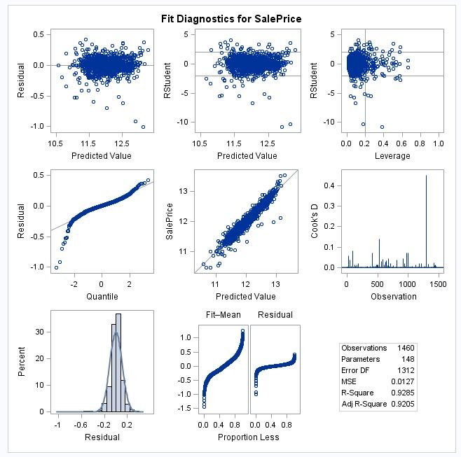

```{r knitr_init, echo=FALSE, cache=FALSE, message=FALSE, warning=FALSE}
library(knitr)
library(rmdformats)

## Global options
options(max.print="75")
opts_chunk$set(echo=FALSE,
               cache=TRUE,
               prompt=FALSE,
               tidy=TRUE,
               comment=NA,
               message=FALSE,
               warning=FALSE,
               fig.align = 'center')
opts_knit$set(width=75)

source("scripts/interp_models.R")
```


***

# Introduction

Buying a house is one of the largest financial decisions many people will make. So many factors go into someone's decision, but it can be hard to really explain why one house "felt right" and another didn't. We want to quantify the factors that add up to someone making the decision to purchase a house.

# Data Description

We will be using the Ames, Iowa individual residential property sales data set freely available on Kaggle.com.  The data set contains 2,930 observations with 79 explanatory variables. All observations occur between 2006 and 2010. Given the geography dependent nature of home value, the results of below analyses can't be applied nationally. For more information on the data, or to download it yourself, visit https://www.kaggle.com/c/house-prices-advanced-regression-techniques.

See the codebook.txt file in the github repository for complete information about all variables.

***

# Exploratory Analysis

Our exploratory analysis was focused on getting a sense for the (numerous) variables in the dataset. We wanted to understand the marginal distributions of individual variables, the relationship between those individual variables and the sale price, and the correlation between the variables themselves.

In `cleaner_script.R` (Appendix C), the training and test sets are cleaned up and plots of variable histograms and scatter/box-plots are created for Sale Price vs each variable.  View the plots [here](images/plots.pdf).

There are several features of a home that are not present for all homes in the data set, most notably various area measurements for home that don't have those features.  There are 14 indicator variables which were created and added to the data set.  The purpose of these variables is to allow flexible fits for features which are missing in some homes.

***

# Questions of Interest

We focused on two approaches, one geared towards model performance and one towards model interpretability by one of the parties involves in a home purchase.

## Interpretable Models

For the interpretable model approach, rather than just taking a handful of easily understood parameters and building a model, we wanted to take a different approach. There are many adages when it comes to home buying, we wanted to see which are the most true. The three ideas about what drives the price of a house that we looked at are as follows:

* Location, location, location!
    * For this model, we used parameters that are related to the physical location of the property. For example, neighborhood, zoning, frontage, lot size, etc.
* It's all about the curb appeal
    * For this model, we used parameters related to the external appearance of the property. For example, house style, roof style, external veneer materials, etc.
* It's what's on the inside that counts
    * For this model, we used parameters related to the internals of the property, the bones if you will. For example, the foundation, the electrical and heating system, etc.
    
We also included the Sale Condition variable in all three models because the context of the sale seems like way too key of a factor to leave out of any model that is meant to be easily interpreted.


### Model Selection

In `scripts/interp_models.R` we went through the process of selecting out variables related to each category, running OLS regression on those sets of variables. We extracted parameter estimates and diagnostic metrics for each model and compared across several values. 

```{r diagnostics_table}
kable(
  bind_cols(
    data.frame(ModelName = c("location", "inside", "outside")),
    bind_rows(model_diags)
    ) %>%
    select(ModelName, adj.r.squared, AIC, BIC, df)
  )
```

Based on R^2^, AIC, and BIC, the best model appears to be the location model. Let's examine some diagnostic plots to make sure the assumptions of linear regression are met.

```{r fig.width=4, fig.height=4, fig.align='center'}
par(pch = ".")
plot(loc_lm$residuals, ylab = 'Residual', main = 'Constant Variance Check', type = 'p')
```

There is not strong evidence against the assumption of constant variance in our residuals. I see a few points that have potentially high leverage, but nothing too egregious so we can proceed.


```{r fig.width=4, fig.height=4, fig.align='center'}
hist(loc_lm$residuals, xlab = 'Residual', main = 'Residual Normality')
```

This histogram shows a symmetric distribution, and does not provide strong evidence against normality.

Our final assumption of independent observations, we will assume the data collection was conducted in a way that will provide independent observations. This assumption is probably the weakest as property values within a given city (and more so within a given neighborhood) are fairly dependent on each other. We will proceed with caution.


### Parameter Interpretation

Below we will take a cursory look at all parameter estimates, then discuss a few of the parameters with the strongest influence on sale price.

```{r fig.height=4, fig.align='center'}
td <- tidy(loc_lm, conf.int = TRUE)
library(ggplot2)
ggplot(td[-1,], aes(estimate, term, color = term)) +
    geom_point() +
    geom_errorbarh(aes(xmin = conf.low, xmax = conf.high)) +
    labs(x = "Coefficient Estimate", y = "Parameter") +
    ggtitle("OLS Parameter Estimates (95% confidence intervals)",
            subtitle = "Intercept Estimate Outside of Axis") +
    theme(legend.position = 'none',
          axis.text.y  = element_text(size=6))
```

The neighborhood variable has quite a lot of levels, but we can get an idea here for all the parameters estimates and a 95% confidence interval. Let's take a closer look at the five variables with the largest coefficient estimates.

```{r}
td %>% arrange(desc(estimate)) %>% slice(2:6) %>% kable()
```

It appears that the zoning variable has the strongest effect on price, as does the size of the lot. The RM Level of the zoning variable means "Residential Medium Density." Bearing in mind that we did a log transform to the sale price (which makes this a log-linear model), we can estimate that a property in this zoning area increases the median sale price by a multiplicative factor of e^.468^ = `r round(exp(.468), 4)`. A 95% confidence interval for that effect is [e^.301^ = `r round(exp(.301), 4)`, e^.634^ = `r round(exp(.634), 4)`] Similarly, zoning classification FV (floating village residential) indicates an e^.354^ = `r round(exp(.354), 4)` multiplier to the median sale price. Our most influential continuous variable, the area of the lot the proper is built on, gives a e^.27^ = `r round(exp(.27), 4)` multiplier to the median sale price for each unit (acre) increase.

## Predictive Models

### Introduction and Type of Selection

The goal of this section is to make as performant a model as possible. We are not trying to be strictly interpretable or parsimonious.  We are primarily focused on optimizing on Kaggle score and model fit statistics.

The process of model optimization begins with an early analysis and review of basic regression assumptions, followed by comparing models across various fit statistics: adjusted R^2, Akaike Information Criterion (AIC), Bayesian Information Criterion (SBC), internal and external average squared error (ASE), and internal cross validation partial residual sum of squares (cv press).  Outliers are excluded where necessary, and interaction terms and polynomial flexibility is considered.

Predictive models analyzed here are limited to one of four types of penalty-based regression estimation: stepwise selection (penalty-free least-squares estimation), modified forward selection via least angle regression selection (lar/lars), least absolute shrinkage and selection operator regression (lasso), and elastic net regression.  More information can be found on these regression types by opening the `data/lars.pdf` file in this repo.

SAS and R will both be used throughout this process.  The latter is used to clean and merge training and test data sets which are exported into SAS for regression estimation.  As mentioned above in the Exploratory Analysis section, The R script used for this is `cleaner_script.R`.

### Early Analysis and Assumption Review

Because of the high number of possible explanatory variables, an initial regression estimation phase is performed in order to ascertain which regression selections tend to minimize key statistics, which will reveal a tentative model to analyze for the purpose of evaluating assumptions.

The following 4 models are compared to identify most common predictors to use for assumption review.  We will use the SPLIT option in SAS to allow for each factor level to enter or exit the model independently.

```{r fig.align='center'}
knitr::include_graphics("images/prelim_model_assumptions.jpg")
```


Since the second model, based on selecting according to lowest BIC, has the fewest predictors, we will proceed with that and check residuals for normality and constant variance.  These predictors are shown in Appendix D, Figure 2.

The residuals displayed in the panel below show excellent conformity with the constant variance and normally-distributed residual assumptions.  There is some evidence of outlier presence in the studentized residual vs predicted value plot (Row 1, Column 2), which will be addressed in the section below on outlier analysis.  We also assumed that the homes included in the training set are independent.  More on this is discussed in the section `Additional Improvements` below.

```{r fig.align='center'}

```

### Model Selection: First Analysis

For the first pass model selection phase, the regression permutations in Figure 1 above are expanded to include LARS, LASSO, and Elastic Net.  There are two choose options used: internal cv press or BIC.  The table below shows all of the model selection permutations used in this modeling phase.

```{r out.width='500pt'}
knitr::include_graphics("images/ms_firstanalysis.jpg")
```

The next set of tables showcase the top 10 models with respect to each of the six target statistics.  Note that 40% of the training data was held out as test data.

```{r out.width='500pt'}
knitr::include_graphics("images/ms_fa_stats1.jpg")
```

```{r out.width='500pt'}
knitr::include_graphics("images/ms_fa_stats2.jpg")
```


Surprisingly, the basic stepwise algorithm that is often heralded as being inferior to penalty-based regression selection methods performed the best overall on all accounts except for the Test ASE.  A figure containing all of the predictors for the above 32 model fits is not included because this is considered exploratory. However, the SAS code provided in `scripts/SAS_Early_Examination.txt` can be used to recreate these exact fits using `SEED=12345` option.

Because the Test ASE is an important statistic to optimize, we cannot only rely on Stepwise selection.  The approach used was an "average predictor" approach in which the frequency that each predictor is selected contributes to its score, with the top scoring predictors across all model selection permutations being used as the set of predictors to include in the regression model.  Furthermore, the training data was not partitioned here to ensure that as much data as possible is being used to establish a set of initial predictors.

Top predictors are defined as having a score of 4 or more.  The score is the average number of times the predictor was selected.  The levels for any categorical predictor that meets this criteria will be examined to identify potential groupings of levels that offer additional degrees of freedom.  This also helps reduce the possibility that our factor level estimates represent training data noise and not a real difference in the predicted sale price.

The unique list of factors in Appendix D, Figure 6 contains every predictor selected in at least one of the 32 regression fits, along with the selection frequency.  Frequency A represents the number of times each factor was selected when the `CHOOSE=CV` option was used, and Frequency B represents the number of times each factor was selected when the `CHOOSE=SBC` option was used.

The table below show the fit statistics for all predictors that scored 4 or higher.  This is labeled model 1.

```{r out.width='500pt'}
knitr::include_graphics("images/ms_model1.jpg")
```


Next, univariate plot analysis revealed useful factor level groups that would create a more parsimonious model.  `PROC SQL` in SAS is used to create these groupings.  The groupings are judgmentally selected for each factor based on patterns seen in Box Plots.  These manual groupings, along with the same predictors in Model 1, form Model 2.  You can find a list of the factor level groupings in `SAS_model2.txt` within the repo scripts folder.

```{r out.width='500pt'}
knitr::include_graphics("images/ms_model2.jpg")
```


Model 3 was developed by dropping `GarageArea` because of it's near-zero estimate and adding `ExterCond` and `GarageQual` in order to capture additional quality-based information about the home.  This led to improved test ASE and Kaggle scores in Model 3.

```{r out.width='500pt'}
knitr::include_graphics("images/ms_model3.jpg")
```


Before adding complexity to the model via interaction terms or attempting to model discontinuities in variables, outliers must be accounted for, which is discussed in the following section.

### Outlier Analysis

Figure 3 above revealed at least two significantly leveraged outliers that had very high studentized residuals (ID 1299 and 524).  In order to investigate these and other outliers,  studentized residuals greater in absolute value than 3.0 are examined. There are 9 homes which met this criteria that were removed from the analysis because either they were deemed outside of the scope of the predictive model, or they were in multiple sparesely populated factor levels which made it difficult to obtain a reliable mean estimate of Sale Price.

The excluded outliers, along with the reasons for doing so, are in Appendix D, Figure 7.  The resulting model fit statistics are below (Model 4).

```{r out.width='500pt'}
knitr::include_graphics("images/ms_model4.jpg")
```


### Model Selection: Interaction Terms and Indicator Variables

With outliers removed, the model was once again studied for opportunities to optimize model fit.  One thing that had not been considered is interactions between any predictors that can explain additional variability or offer more flexible parameterizations.

There are a few variables with strong linear correlations in the training data set. `GarageCars/Garage Area`, `TotRmsAbvGrd`, and `GrLivArea` will be variables that probably should never have interactions included in the model if the correlated terms are present.  A table of all Pearson correlations greater than .5 is shown in Appendix D, Figure 8.  These were considered significant enough to be mindful of when selecting interactions.


A first attempt to discover interactions was made by regressing partial residuals from Model 4 on all possible interaction combinations using `PROC GLMSELECT`.  However, this yielded no useful results because no terms were identified. It could be that the selection methods were not sensitive enough to changes in partial residuals that were based on an already-decent model.  In other words, they may have been too small.

By manually trying potential interactions and examining fit statistics, the following two interactions were identified by their respectable p-values and Model III sum of squares (the marginal sum of squares obtained if the variable were entered last into the model).

> 1. GrLivArea*FullBath
  2. LotArea*Foundation

The Model Performance Statistics table is updated with Model 5, which includes the two interactions listed here.

```{r out.width='500pt'}
knitr::include_graphics("images/ms_model5.jpg")
```

AFter this, two indicator terms (`idxhasNoFB1` and `idxhasNoWD`) were included to allow increased flexibility in the parameterizations of the `BsmtFinSF1*idxhasFB1` and `WoodDeckSF*idxhasWD` interactions that were in Models 1-3.  This essentially allowed for homes without these features to be fit to a separate parameter so that the polynomial fits represent homes that actually have the feature.

```{r out.width='500pt'}
knitr::include_graphics("images/ms_model6.jpg")
```


In the 7th model iteration, YearBuilt was converted into a piecewise interaction with an old vs new indicator so that we can allow for differing polynomial regression slopes based on whether homes are built after 2000.  An additional continuous variable for 2nd floor square footage was added, and a few variables had their factor levels rearranged for optimal fit.

```{r out.width='500pt'}
knitr::include_graphics("images/ms_model7.jpg")
```


###Top Models

Models 4, 3, and 2 had the top test ASE scores, and models 7, 6, and 5 had the top kaggle scores.

The figure below is a screenshot of the top Kaggle score received.  The R code in appendix C and SAS code in appendix D can recreate the CSV file submitted to Kaggle.  The CSV file itself is also located in the appendix folder of this repo.

```{r out.width='500pt'}
knitr::include_graphics("images/kaggle.jpg")
```

### Additional Improvements

The predictive capabilities utilized here did not make use of any clustering analysis that may have provided improved model fits.  For example, rather than using 2000 as a "flex" point for the polynomial term YearBuilt, we could have optimized the flex point based on some sort of variability optimization between homes built before 2000 and those built after 2000.

Another consideration is the assumption of independence in the context of home sale prices.  It can be argued that sale price does reflect the sale prices of neighboring homes.  These neighboring home sale prices are included in every home appraisal and give every shopper a benchmark price to compare the home they are looking at with.  It is hard to imagine this results in a truly independent set of home sale prices in the area.  Perhaps some analysis can be done to examine correlations in home sale prices and reflect this in the standard errors of the sale price regression model.

***

# Conclusion

In the battle of the property value tropes, it turns out that the old adage of "location, location, location" is right afterall. We compared models that focused on location, curb appeal, and the interior construction of a property, and found that on all measures, the location centric model was most predictive. This is useful for the parties in a real estate transaction because they know that playing up the location of a property can lead to a higher sale price. On the flipside, if you are looking for a home, it is good to know that you can likely get a good deal on a otherwise very nice property if you are williing to live outside of the premier neighborhoods.

# Appendix: Code for all analyses

## Appendix A: interp_models.R
The below commented code provides the steps taken in order to create, analyze, and select our models focused on interpretability.
```{r comment=''}
cat(readLines('scripts/interp_models.R'), sep = '\n')
```

## Appendix B: cleaner_funs.R

The below code provides the functions we used for cleaning up the data set.
```{r comment=''}
cat(readLines('scripts/cleaner_funs.R'), sep = '\n')
```

## Appendix C: cleaner_script.R

The below code provides the script that calls the above cleaner functions, and does various other data cleaning.
```{r comment=''}
cat(readLines('scripts/cleaner_script.R'), sep = '\n')
```

## Appendix C: sas_modeling.txt

The below code provides the SAS code used for generating and evaluating our SAS regressions used for finding the most predictive model.

```{r comment=''}
cat(readLines('scripts/SAS_Model7.txt'), sep = '\n')
```
## Appendix D: Extra Figures

Figure 1: Predictors used in assumption validation model  
```{r out.width="200px"}
knitr::include_graphics("images/modelterms_assumptions.jpg")

```

Figures 2 and 3: Model Predictors and Associated Scores  
```{r}
knitr::include_graphics("images/ms_fa_comb1.jpg")
knitr::include_graphics("images/ms_fa_comb2.jpg")
```

Figure 4: Outliers Removed and Explanation  
```{r out.width='500pt'}
knitr::include_graphics("images/outlier_list.jpg")
```

Figure 5: Linear Correlations in Training Data Sample

```{r out.width='500pt'}
knitr::include_graphics("images/correlations.jpg")
```


