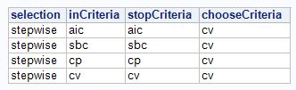

```{r knitr_init, echo=FALSE, cache=FALSE, message=FALSE, warning=FALSE}
library(knitr)
library(rmdformats)

## Global options
options(max.print="75")
opts_chunk$set(echo=FALSE,
               cache=TRUE,
               prompt=FALSE,
               tidy=TRUE,
               comment=NA,
               message=FALSE,
               warning=FALSE)
opts_knit$set(width=75)

source("scripts/interp_models.R")
```


***

# Introduction

Buying a house is one of the largest financial decisions many people will make. So many factors go into someone's decision, but it can be hard to really explain why one house "felt right" and another didn't. We want to quantify the factors that add up to someone making the decision to purchase a house.

# Data Description

We will be using the Ames, Iowa individual residential property sales data set freely available on Kaggle.com.  The data set contains 2,930 observations with 79 explanatory variables. All observations occur between 2006 and 2010. Given the geography dependent nature of home value, the results of below analyses can't be applied nationally. For more information on the data, or to download it yourself, visit https://www.kaggle.com/c/house-prices-advanced-regression-techniques.

See the codebook.txt file in the github repository for complete information about all variables.

***

# Exploratory Analysis

Our exploratory analysis was focused on getting a sense for the (numerous) variables in the dataset. We wanted to understand the marginal distributions of individual variables, the relationship between those individual variables and the sale price, and the correlation between the variables themselves.

In `cleaner_script.R` (Appendix C), the training and test sets are cleaned up and plots of variable histograms and scatter/box-plots are created for Sale Price vs each variable.  View the plots [here](images/plots.pdf).

There are several features of a home that are not present for all homes in the data set, most notably various area measurements for home that don't have those features.  There are 14 indicator variables which were created and added to the data set.  The purpose of these variables is to allow flexible fits for features which are missing in some homes.

To see the mathematical intent of these indicator variables, consider the univariate model Log(SalePrice) = For example, the plot below shoes the Log of Sale Price vs Log of Lot Frontage.  ***Continue discussion later***

***

# Questions of Interest

We focused on two approaches, one geared towards model performance and one towards model interpretability by one of the parties involves in a home purchase.

## Interpretable Models

For the interpretable model approach, rather than just taking a handful of easily understood parameters and building a model, we wanted to take a different approach. There are many adages when it comes to home buying, we wanted to see which are the most true. The three ideas about what drives the price of a house that we looked at are as follows:

* Location, location, location!
    * For this model, we used parameters that are related to the physical location of the property. For example, neighborhood, zoning, frontage, lot size, etc.
* It's all about the curb appeal
    * For this model, we used parameters related to the external appearance of the property. For example, house style, roof style, external veneer materials, etc.
* It's what's on the inside that counts
    * For this model, we used parameters related to the internals of the property, the bones if you will. For example, the foundation, the electrical and heating system, etc.
    
We also included the Sale Condition variable in all three models because the context of the sale seems like way too key of a factor to leave out of any model that is meant to be easily interpreted.


### Model Selection

After running our three models, let's take a look at some diagnostics. After picking a model based on diagnostics, we will examine assumptions and parameters.

```{r diagnostics_table}
kable(
  bind_cols(
    data.frame(ModelName = c("location", "inside", "outside")),
    bind_rows(model_diags)
    ) %>%
    select(ModelName, adj.r.squared, AIC, BIC, df)
  )
```

Based on R^2^, AIC, and BIC, the best model appears to be the location model. Let's examine some diagnostic plots to make sure the assumptions of linear regression are met.

```{r fig.width=4, fig.height=4, fig.align='center'}
plot(loc_lm$residuals, ylab = 'Residual', main = 'Constant Variance Check')
```

In the plot above, it appears there is not strong evidence against the assumption of constant variance in our residuals. I see a few points that have potentially high leverage, but nothing too egregious so we can proceed.


```{r fig.width=4, fig.height=4, fig.align='center'}
hist(loc_lm$residuals, xlab = 'Residual', main = 'Residual Normality')
```

This histogram shows a symmetric distribution, and does not provide strong evidence against normality.

Our final assumption of independent observations, we will assume the data collection was conducted in a way that will provide independent observations. This assumption is probably the weakest as property values within a given city (and more so within a given neighborhood) are fairly dependent on each other. We will proceed with caution.


### Parameter Interpretation

Below we will take a cursory look at all parameter estimates, then discuss a few of the parameters with the strongest influence on sale price.

```{r fig.height=4, fig.align='center'}
td <- tidy(loc_lm, conf.int = TRUE)
library(ggplot2)
ggplot(td[-1,], aes(estimate, term, color = term)) +
    geom_point() +
    geom_errorbarh(aes(xmin = conf.low, xmax = conf.high)) +
    labs(x = "Coefficient Estimate", y = "Parameter") +
    ggtitle("OLS Parameter Estimates (95% confidence intervals)",
            subtitle = "Intercept Estimate Outside of Axis") +
    theme(legend.position = 'none')
```

The neighborhood variable has quite a lot of levels, but we can get an idea here for all the parameters estimates and a 95% confidence interval. Let's take a closer look at the five variables with the largest coefficient estimates.

```{r}
td %>% arrange(desc(estimate)) %>% slice(2:6) %>% kable()
```

It appears that the zoning variable has the strongest effect on price, as does the size of the lot. The RM Level of the zoning variable means "Residential Medium Density." Bearing in mind that we did a log transform to the sale price (which makes this a log-linear model), we can estimate that a property in this zoning area increases the median sale price by a multiplicative factor of e^.458^ = `r round(exp(.458), 4)`. Similarly, zoning classification FV (floating village residential) indicates an e^.354^ = `r round(exp(.354), 4)` multiplier to the median sale price. Our most influential continuous variable, the area of the lot the proper is built on, gives a e^.27^ = `r round(exp(.27))` multiplier to the median sale price for each unit (acre) increase.

## Predictive Models

### Introduction and Type of Selection

The goal of this section is to make as performant a model as possible. We are not trying to be interpretable or parsimonious, we are primarily optimizing on Kaggle score or average squared error for test data sets (and ideally also for training data sets).

The process of of model optimization begins with an early analysis and review of basic regression assumptions, followed by comparing individual model performances for various fit statistics: adjusted R^2, Akaike Information Criterion (AIC), Bayesian Information Criterion (SBC), internal and external average squared error (ASE), and internal cross validation partial residual sum of squares (cv press).  The final step is to optimize models by including new features and interactions.

Predictive models analyzed here are limited to one of four types of penalty-based regression estimation: stepwise selection (penalty-free least-squares estimation), modified forward selection via least angle regression selection (lar/lars), least absolute shrinkage and selection operator regression (lasso), and elastic net regression.  More information can be found on these regression types here.

SAS and R will both be used throughout this process.  The latter is used to clean and merge training and test data sets which are exported into SAS for regression estimation.  As mentioned above in the Exploratory Analysis section, The R script used for this is `cleaner_script.R`.

### Early Analysis and Assumption Review

Because of the high number of possible explanatory variables, an initial regression estimation phase is performed in order to ascertain which regression selections tend to minimize key statistics, which will reveal a tentative model to analyze for the purpose of evaluating assumptions.

The following 4 models are compared to identify most common predictors to use for assumption review.  We will use the SPLIT option in SAS to allow for each factor level to enter or exit the model independently.



Since the second model, based on selecting according to lowest BIC, has the fewest predictors, we will proceed with that and check residuals for normality and constant variance.  These predictors and diagnostic plots are shown below.


The residuals displayed in the panel below show excellent conformity with the constant variance and normally-distributed residual assumptions.  There is some evidence of outlier presence in the studentized residual vs predicted value plot (Row 1, Column 2), which will be addressed in the section below on outlier analysis.


### Model Selection: First Analysis

For the first pass model selection phase, the regression permutations in Figure 1 above are expanded to include LARS, LASSO, and Elastic Net.  There are two choose options used: internal cv press or BIC.  The table below show all of the model selection permutations used in this modeling phase.


The tables below showcase the top 10 models with respect to each of the six target statistics.  Note that 40% of the training data was held out as test data.


Surprisingly, the basic stepwise algorithm that is often heralded as being inferior to penalty-based regression selection methods performed the best overall on all accounts except for the Test ASE.  A figure containing all of the predictors for the above 32 model fits is not included because this is considered exploratory. However, the SAS code provided in the appendix can be used to recreate these exact fits using SEED=12345 option.

Because the Test ASE is an important statistic to optimize, we will take an "average predictor" approach in which the frequency that each predictor is selected contributes to its score, with the top scoring predictors across all models being used as the set of predictors to include in the regression model.  Furthermore, we will not partition the data set for this part to ensure that we using as much data as possible to establish a set of initial predictors.

Top predictors are defined as having a score of 4 or more.  The score is the average number of times the predictor was selected.  The levels for any categorical predictor that meets this criteria will be examined to identify potential groupings of levels that offer additional degrees of freedom.  This also helps reduce the possibility that our factor estimates represent training data noise and not a real difference in the predicted sale price.

The unique list of factors below contains every predictor selected in at least one of the 32 regression fits.  Frequency A represents the number of times each factor was selected when the `CHOOSE=CV` option was used, and Frequency B represents the number of times each factor was selected when the `CHOOSE=SBC` option was used.  This is Model 1.
 
 

In addition, manual factor level grouping was performed by analyzing group patterns and judgmentally selecting similar groups or combining groups without sufficient information to reliably estimate an average for that group.  These manual groupings along with the same predictors in Model 1 form Model 2.  Finally, Model 3 expands on Model 2 by including additional variables which improved the overall fit.

The table below shows the test ASE and Kaggle scores for Models 1-3.

    
### Outlier Analysis

### Model Selection: Second Analysis and Kaggle

### Additional Improvements
    

***

# Conclusion

In the battle of the property value tropes, it turns out that the old adage of "location, location, location" is right afterall. We compared models that focused on location, curb appeal, and the interior construction of a property, and found that on all measures, the location centric model was most predictive. This is useful for the parties in a real estate transaction because they know that playing up the location of a property can lead to a higher sale price. On the flipside, if you are looking for a home, it is good to know that you can likely get a good deal on a otherwise very nice property if you are williing to live outside of the premier neighborhoods.

# Appendix: Code for all analyses

## Appendix A: interp_models.R
The below commented code provides the steps taken in order to create, analyze, and select our models focused on interpretability.
```{r comment=''}
cat(readLines('scripts/interp_models.R'), sep = '\n')
```

## Appendix B: cleaner_funs.R

The below code provides the functions we used for cleaning up the data set.
```{r comment=''}
cat(readLines('scripts/cleaner_funs.R'), sep = '\n')
```

## Appendix C: cleaner_script.R

The below code provides the script that calls the above cleaner functions, and does various other data cleaning.
```{r comment=''}
cat(readLines('scripts/cleaner_script.R'), sep = '\n')
```

## Appendix C: sas_modeling.txt

The below code provides the SAS code used for generating and evaluating our SAS regressions used for finding the most predictive model.

```{r comment=''}
#cat(readLines('scripts/sas_modeling.txt'), sep = '\n')
```

